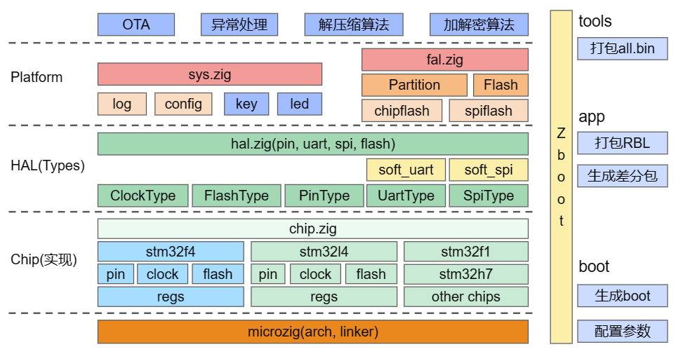

# stm32-zboot
Universal stm32 boot written using zig，Compatible with [RT-Thread stm32-Bootloader](https://www.rt-thread.org/document/site/#/rt-thread-version/rt-thread-standard/application-note/system/rtboot/an0028-rtboot?id=%e7%ae%80%e4%bb%8b).



## Roadmap

### M0: F4 series basic boot (rom < 8k)

 - [x] Serial port log output
 - [x] jump to app
 - [x] chip-flash manage
 - [x] flash partition abstraction layer(Compatible with FAL)
 - [x] The whole package upgrade

### M1: Normal boot (rom < 16k)

 - [x] Support L4 series 
 - [x] Firmware crc check
 - [ ] Firmware decompression
 - [x] Support spi nor flash 
 - [x] Basic zboot Tool

### M2: More series boot (rom < 32k)

- [x] Support H7 series (no xip)
- [ ] Support H7 series (XIP Flash)
- [ ] Support differential upgrade
- [ ] zboot Tool

## How to build

```
zig build
```

## How to use zboot Tool

### Usage

```
.\zig-out\bin\zboot.exe .\zig-out\firmware\zboot-f4.bin
```

